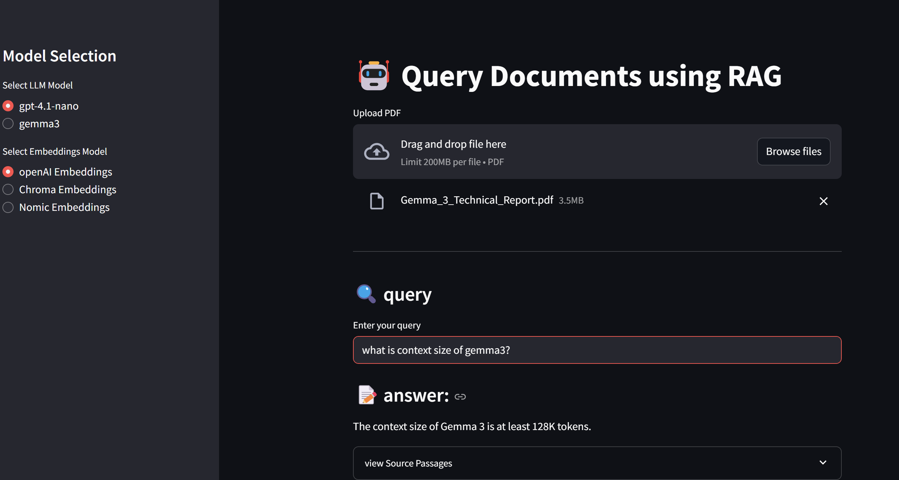

# 📄 Query Documents using RAG

This project enables intelligent querying of PDF documents using a **Retrieval-Augmented Generation (RAG)** approach. Users can upload documents and get accurate, context-aware answers by leveraging different combinations of **LLMs** (Large Language Models) and **embedding models**.

---

## 🚀 Features

- **Upload PDFs** up to 200MB
- **Query in natural language** and receive concise, document-grounded answers
- **Switch between LLMs**:
  - `gpt-4.1-nano` (Frontier)
  - `gemma3` (Open-source)
- **Choose embedding models**:
  - OpenAI Embeddings
  - Chroma Embeddings
  - Nomic Embeddings
- **View source passages** for full transparency
- Interactive and user-friendly UI

---

## 🧠 How It Works

1. **Upload a PDF** file (e.g., technical reports, research papers).
2. **Select** your preferred LLM and embedding model.
3. **Ask a question** about the content.
4. The system retrieves relevant chunks, passes them to the selected LLM, and **generates a response**.
5. **View the source** of the answer for verification.

---

## 🛠️ Tech Stack

- **Frontend:** Streamlit
- **Backend:** Python
- **LLMs:** GPT-4.1-nano, Gemma 3
- **Embeddings:** OpenAI, Chroma, Nomic
- **Vector Store:** Integrated vector database (e.g., ChromaDB or FAISS)
- **RAG Pipeline:** Custom chunking, embedding, vector search, and generation

---

## 📷 Interface Snapshot

---

## 📌 Use Cases

- Research Q&A
- Legal document analysis
- Technical report summarization
- Personalized document assistants
